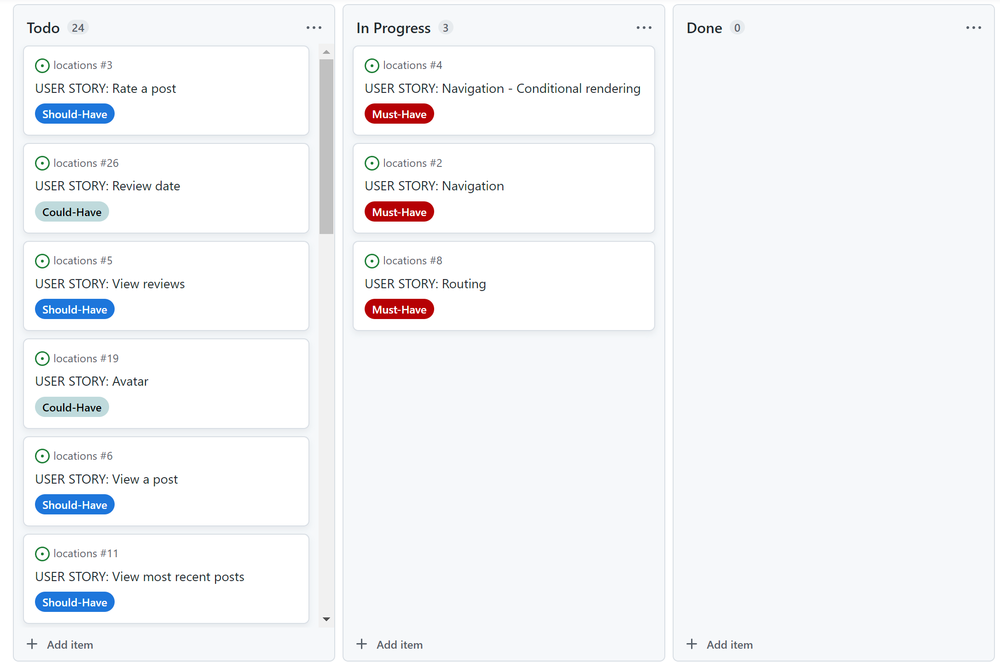
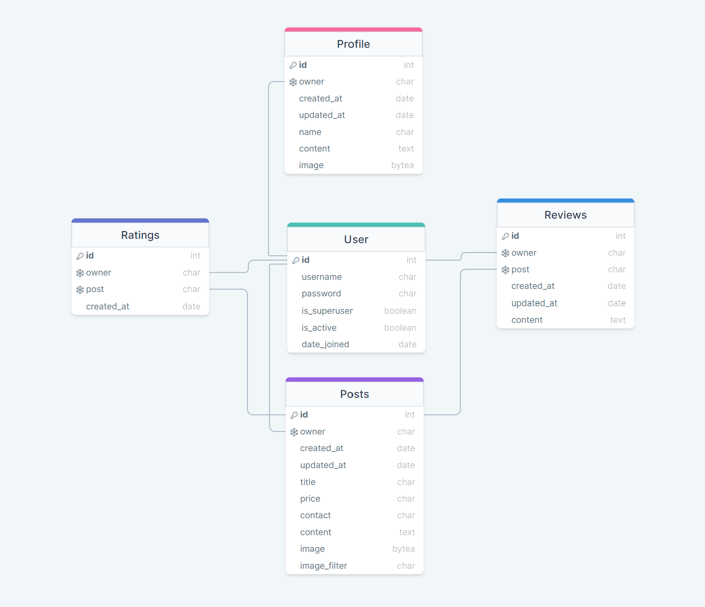

# Locations

Locations is a React website that offers the user an opportunity to post a rental location.

The main purpose of the app is to provide users the ability to share their unused housing for rental purposes, thus being able to drive in additional income.

Visit the deployed application [here](https://locations-p5.herokuapp.com/).

## Table of Contents

1. [User Experience (UX)]
    1. [Strategy]
        1. [Project Goals]
        2. [User Goals]
        3. [Strategy Table]
    2. [Scope]
        1. [User Stories]
    3. [Structure]
        1. [Database Model]
    4. [Skeleton]
        1. [Wireframes]
    5. [Surface](#surface)
        1. [Color Scheme]
        2. [Typography]

## User Experience (UX)

### Strategy

#### Project Goals

* Structure is easy to grasp and navigation is effortless, for an easy user experience.

* The color scheme is a dark grey background with pastel blue accents to make it easier on the eyes when using the app.

* The design is responsive to make the app accessible on multiple screen sizes.

* Site users are offered the chance to create an account, and are encouraged to do so on the home page.

* An easy post process makes the experience easier.

#### User Goals

**Epic 1 - Account Experience**

* As a user I can create a new account so that I can access all the features for signed up users.

* As a user I can sign in to the app so that I can access functionality for logged in users.

* As a user I can tell if I am logged in or not so that I can log in if I need to.

* As a user I can maintain my logged-in status until I choose to log out so that my user experience is not compromised

**Epic 2 - Profile Experience**

* As a logged in user I can edit my profile so that I can change my profile picture and bio

* As a logged in user I can update my username and password so that I can change my display name and keep my profile secure.

* As a user I can view statistics about a specific user: bio and number of posts so that I can learn more about them

* As a user I can view user's avatars so that I can easily identify users of the application

**Epic 3 - Post Experience**

* As a logged in user I can create posts so that I can share my images with the world!

* As a post owner I can edit my post title and description so that I can make corrections or update my post after it was created

**Epic 4 - Navigation Experience**

* As a user I can view a navbar from every page so that navigate easily between pages

* As a logged out user I can see sign in and sign up options so that I can sign in/sign up

* As a user I can navigate through pages quickly so that view content seamlessly without page refresh

* As a user I can view the details of a single post so that I can learn more about it

* As a user I can view all the most recent posts, ordered by most recently created first so that I am up to date with the newest content

* As a user I can read reviews on posts so that I can read what other users think about the posts

* As a user I can view other users profiles so that I can see their posts and learn more about them.

* As a user I can view all the posts by a specific user so that I can catch up on their latest posts

* As a user I can view the posts page so that I can read the comments about the post

* As a user I can keep scrolling through the images on the site, that are loaded for me automatically so that I don't have to click on "next page" etc

* As a user, I can search for posts with keywords, so that I can find the posts and user profiles I am most interested in.

**Epic 5 - Actions Experience**

* As a logged in user I can rate a post so that I can show my support for the posts that I liked me

* As an owner of a review I can delete my review so that I can control removal of my review from the application

* As an owner of a review I can edit my review so that I can fix or update my existing review

* As a user I can see how long ago a review was made so that I know how old a review is

* As a logged in user I can add reviews to a post so that I can share my thoughts about the post

### Strategy

To achieve the strategy goals, I wish to implement the following features:

* A navigation bar, that will be fixed at the top, that will allow the user to easily navigate the app.

* A Home page, which will allow the user the user to take part of the posts, as well as urging the user to sign up and post their own locations.

* A Sign Up page, that will allow the user to create their own account.

* A Sign In page, that will allow the user to sign in to their account.

* A Add Post page, that allows the user to add their own post.

* A Profile page, that will display the user's posts and allow them to edit their profile.

* A Searc Bar, to allow users to search for specific posts.

* A fully responsive design that works well on different screen sizes and devices.

* An Error 404 page that tells the user that a page does not exist.

* A full CRUD functionality for users to create, read, update and delete posts, and edit their profiles.

### Scope

GitHub projects was used as my project management tool to track the determined user stories. A Kanban board was used to focus on specific tasks, where each was labelled as "must-have", "should-have" and "could-have" to focus the attention on what must be achieved vs what ought to be achieved.

**Start**

**Step 2**

**Step 3**

**Step 4**

**Step 5**

**Step 6**

**Step 7**

#### Database

The databse model was designed using [drawsql](https://drawsql.app/) The type of databases being used are SQLite3 during development, and [PostgreSQL](https://www.postgresql.org/).

